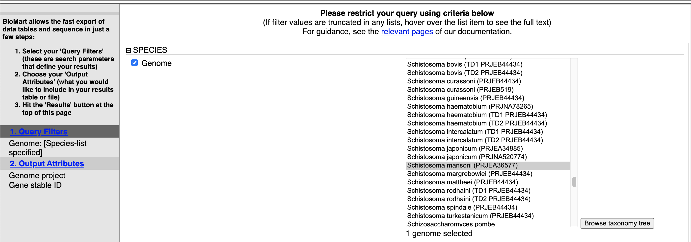
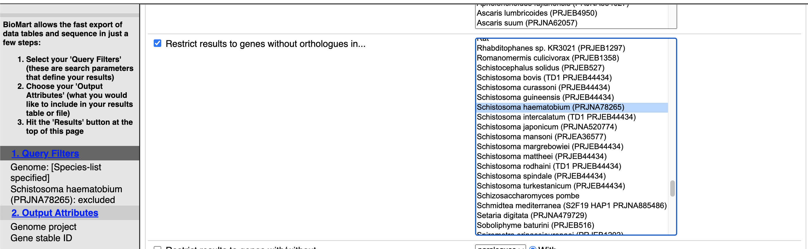
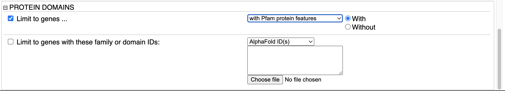
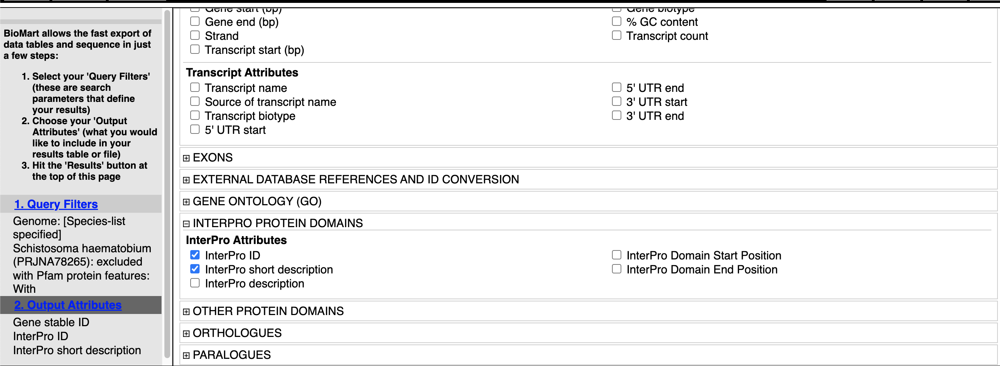
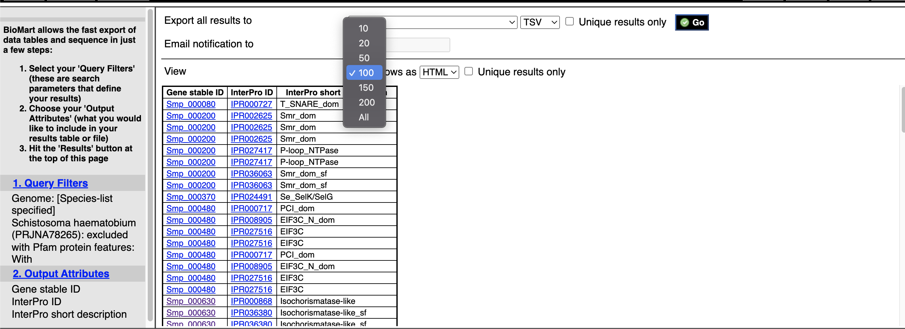
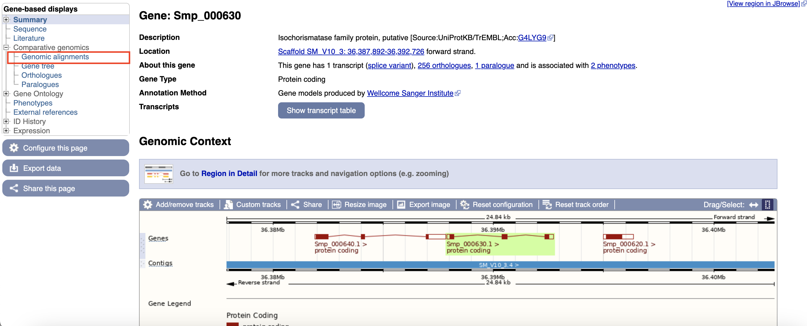
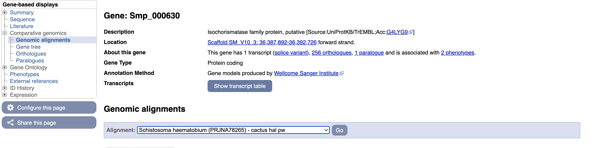

So far we have seen how you can manually browse WormBase ParaSite by searching for genes and then navigating to their gene/transcript/protein pages. However, in many cases you might have to automatically extract information from WormBase ParaSite for multiple entries. Or simply you might need to extract information about your favourite genome's features that fullfil some criteria.

BioMart is an extremely powerful tool that allows you to query WormBase ParaSite data in bulk, with no programming knowledge. Consider the information that we gathered on our _O. viverrini_ gene of interest, by clicking around the gene page. Now imagine that rather than having one gene of interest, we actually have a list of 100 genes. That would be a lot of clicking around on gene pages! BioMart allows you to output all of this data for multiple genes in a few clicks.

Retrieving data for a list of known genes isn’t the only thing that BioMart can do. In this section, we’ll go through a series of examples and exercises that aim to illustrate the power of this tool. 

There are two main steps involved in building a BioMart query.
- **Filters**: Firstly, a set of criteria are defined which the genes, transcripts, or proteins must conform to in order to be included in the results. These are referred to as *Query Filters*. 
- **Output Attributes**: Secondly, the data-types to include in the output list are defined. These are Output Attributes.

Some of the *filters* allow you to enter data to filter on, e.g. a list of gene names.

- Example: if you wanted to obtain the genomic locations of a list of genes that were of interest to you, you would provide the list of gene names in the *Query Filters*, and denote that you want to see genomic locations in the *Output Attributes*.

The table below lists some examples of filters and attributes for BioMart queries:

| Examples  of Filters       | Examples of Attributes           | 
| ------------- |-------------| 
| A genome      | Gene, transcript or protein IDs | 
| A genomic region | Sequences      |
| A list of gene IDs| Identifiers from external databases (eg, Uniprot IDs)      |
| All genes that have GO term x, or protein domain Y| Protein domains or GO terms associated with a gene ID    |
| All genes that have GO term x, or protein domain Y| IDs of orthologous genes, % identity   | 

Query Filters and Output attributes can be combined to produce more complex queries and customised output.

Let's try to explore high confidence genes that do not have an orthologue in _S. haematobium_:
- Are of high-confidence (Have at least one PFAM domain annotated).
- Do not have orthologues in _Schistosoma haematobium_ PRJNA78265 genome.

1. From the WormBase ParaSite homepage, select BioMart from the tool bar, or the BioMart icon.

We have to set three Query Filters: the genome (the _S. mansoni_ genome), genes with PFAM protein features and genes that do not have orthologues in _S. haematobium_.

2. Select “Species”, tick the “genome” checkbox and scroll down to select “Schistosoma mansoni (PRJEA36577)”.

3. Select “HOMOLOGY (ORTHOLOGUES AND PARALOGUES)" and tick the "Restrict results to genes with orthologues in ..." and then select "Schistosoma haematobium (PRJNA78265)" from the list on the right.

4. Select “PROTEIN DOMAINS”, tick the “Limit to genes ...” check box and then select "with Pfam protein features" from the drop-down menu.

Note that as we have built up the query, the filters have appeared on the left hand side of the page.

5. Click “count” to count the number of genes in the database that fulfil these filter criteria.

Next we will select the output attributes.

6. Select “Output attributes”

BioMart lets us generate two types of output: data tables, and sequence (FASTA) files. In this example we’ll be generating a data table. We want to retrieve the gene IDs and associated protein domains of the 215 genes that fulfil our filter criteria.

7. Untick "Genome Project ID" under the "SPECIES AND GENOME INFORMATION" tab. 

8. Tick "Gene stable ID" and "Gene name" under the "GENE" tab.

9. Select “Interpro protein domains” and check the tick boxes for “InterPro ID”, “InterPro short description”.

10. Click “Results” to see a preview of your results table. The full results table can be downloaded by selecting the file type you’d like to download and clicking “Go”.

10. Smp_000630 (isochorismatase) looks interesting. Why does it not have an orthologue in _S. haematobium_? 

11. Click on the gene id "Smp_000630". This will redirect you to the gene page for "Smp_000630".

[↥ **Back to top**](#top)

---
