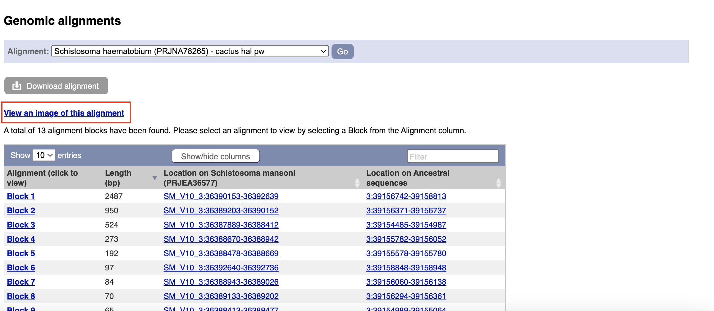

## Using BioMart 

The most common way to browse WormBase ParaSite is to search for genes and then navigate to their gene/transcript/protein pages to get the information you need.

However, in many cases you might have to automatically extract information from WormBase ParaSite for multiple entries. Or simply you might need to extract information about your favourite genome's features that fullfil some criteria.

BioMart is an extremely powerful tool that allows you to query WormBase ParaSite data in bulk, with no programming knowledge. Imagine, for example, that you need to find the Gene Ontology terms associated with 100 _O. volvulus_ genes of interest. That would be a lot of clicking around on gene pages! BioMart allows you to output all of this data for multiple genes in a few clicks.

There are two main steps involved in building a BioMart query.
- **Filters**: Firstly, a set of criteria are defined which the genes, transcripts, or proteins must conform to in order to be included in the results. These are referred to as *Query Filters*. 
- **Output Attributes**: Secondly, the data-types to include in the output list are defined. These are Output Attributes.

Some of the *filters* allow you to enter data to filter on, e.g. a list of gene names.

- Example: if you wanted to obtain the genomic locations of a list of genes that were of interest to you, you would provide the list of gene names in the *Query Filters*, and denote that you want to see genomic locations in the *Output Attributes*.

The table below lists some examples of filters and attributes for BioMart queries:

| Examples  of Filters       | Examples of Attributes           | 
| ------------- |-------------| 
| A genome      | Gene, transcript or protein IDs | 
| A genomic region | Sequences      |
| A list of gene IDs| Identifiers from external databases (eg, Uniprot IDs)      |
| All genes that have GO term x, or protein domain Y| Protein domains or GO terms associated with a gene ID    |
| All genes that have GO term x, or protein domain Y| IDs of orthologous genes, % identity   | 

Query Filters and Output attributes can be combined to produce more complex queries and customised output.

For this workshop let's focus on two really important species of medical importance. _S. mansoni_ and _S. haematobium_.

Comparing gene models of _S. mansoni_ and _S. haematobium_ could prove valuable by identifying their shared genetic elements and species-specific adaptations, aiding our understanding of their biology and pathogenicity. These two species are vital as they are responsible for the majority of schistosomiasis cases worldwide, making their study crucial for global health efforts.

Let's try to explore high confidence genes in _S. mansoni_ that do not have an orthologue in _S. haematobium_. This way we can explore why these high-confidence genes do show orthology between these 2 species.

To do that we need to use BioMart filters for _S. mansoni_ genes that
- Are of high-confidence (Have at least one PFAM domain annotated).
- Do not have orthologues in _Schistosoma haematobium_ PRJNA78265 genome.

1. From the WormBase ParaSite homepage, select BioMart from the tool bar, or the BioMart icon.

We have to set three Query Filters: the genome (the _S. mansoni_ genome), genes with PFAM protein features and genes that do not have orthologues in _S. haematobium_:

2. Select “Species”, tick the “genome” checkbox and scroll down to select “Schistosoma mansoni (PRJEA36577)”.

3. Select “HOMOLOGY (ORTHOLOGUES AND PARALOGUES)" and tick the "Restrict results to genes with orthologues in ..." and then select "Schistosoma haematobium (PRJNA78265)" from the list on the right.

4. Select “PROTEIN DOMAINS”, tick the “Limit to genes ...” check box and then select "with Pfam protein features" from the drop-down menu.

Note that as we have built up the query, the filters have appeared on the left hand side of the page.

5. Click “count” to count the number of genes in the database that fulfil these filter criteria.

Next we will select the output attributes.

6. Select “Output attributes”

BioMart lets us generate two types of output: data tables, and sequence (FASTA) files. In this example we’ll be generating a data table. We want to retrieve the gene IDs and associated protein domains of the 215 genes that fulfil our filter criteria.

7. Untick "Genome Project ID" under the "SPECIES AND GENOME INFORMATION" tab. 

8. Tick "Gene stable ID" and "Gene name" under the "GENE" tab.

9. Select “Interpro protein domains” and check the tick boxes for “InterPro ID”, “InterPro short description”.

10. Click “Results” to see a preview of your results table. Use the dropdown button to see more table rows on the page. The full results table can be downloaded by selecting the file type you’d like to download and clicking “Go”.

10. Smp_000630 (isochorismatase) looks interesting. Why does it not have an orthologue in _S. haematobium_?

11. Click on the gene id "Smp_000630". This will redirect you to the gene page for "Smp_000630".

[↥ **Back to top**](#top)

---

## Explore Genomic Pairwise Alignments between genomes in WormBase ParaSite
You are now in the gene page of [_Smp_000630_](https://parasite.wormbase.org/Schistosoma_mansoni_prjea36577/Gene/Summary?db=core;g=Smp_000630;r=SM_V10_3:36381195-36394370;t=Smp_000630.1).

To compare the genomic region of this gene with the S. haematobium genome you can view their pair-wise genomic alignment.

To do that:

12. Click the "Genomic Alignments" button under "Comparative Genomics" in the left-hand side menu.

14. In the middle of the screen, use the dropdown menu to select "Schistosoma haematobium (PRJNA78265)" from the list.

15. Click "View an image of this alignment" 
15. You can now see the alignments showing between the two genomes for the region. Aligned regions between the 2 genomes appear as orange highlighted regions in the background. Utilize the navigation and zoom buttons within the Ensembl Genome Browser to explore the region.

16. Upon zooming out, it becomes evident that there is an orthologue of Smp_000630 in S. haematobium (PRJNA78265) that our comparative genomics pipeline overlooked. Additionally, it is noteworthy that what initially appears as two distinct genes in S. mansoni (Smp_000640 and Smp_000630) corresponds to a single gene in S. haematobium (MS3_00005743).

17. To further investigate this intriguing finding in both genomes, we can use JBrowse. JBrowse offers a faster and lighter interface compared to the Ensembl Genome Browser and aligns well with our annotation tool, Apollo.

18. To access JBrowse views for each genome, return to the Genome List (click the "Genome List" button in the upper menu). Once you are in the table listing all genomes, scroll down to locate "Schistosoma mansoni (SM_V10)" and click on the "Jbrowse" button for this genome. Follow the same procedure to open a JBrowse view for "Schistosoma haematobium (UoM_Shae.V3)."

19. In both JBrowse instances, use the search box to look for the genes of interest: Smp_000630 for S. mansoni and MS3_00005743 for S. haematobium. Adjust the regions using the navigation and zoom buttons in the upper panel. To compare the two JBrowse regions, position the windows one below the other.

