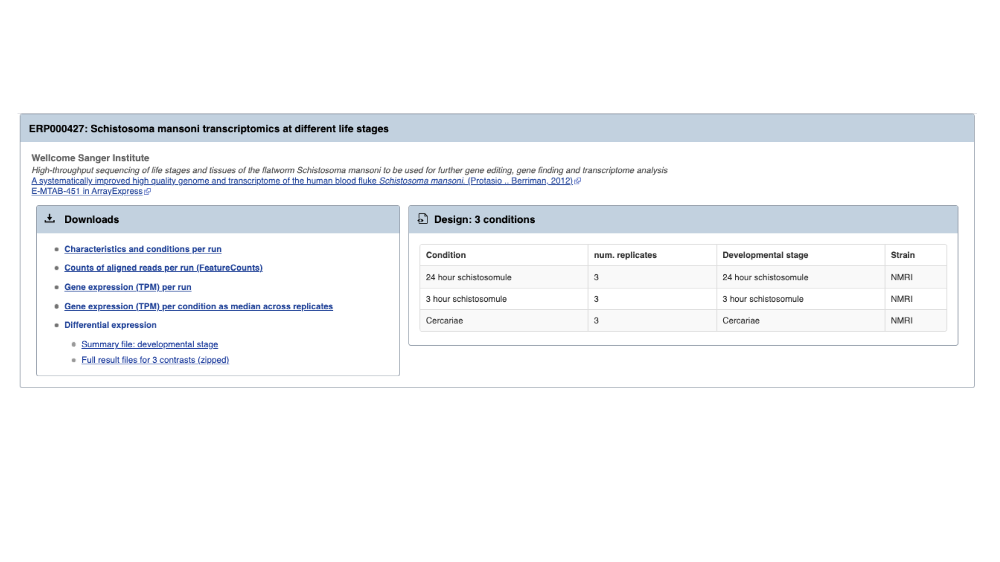
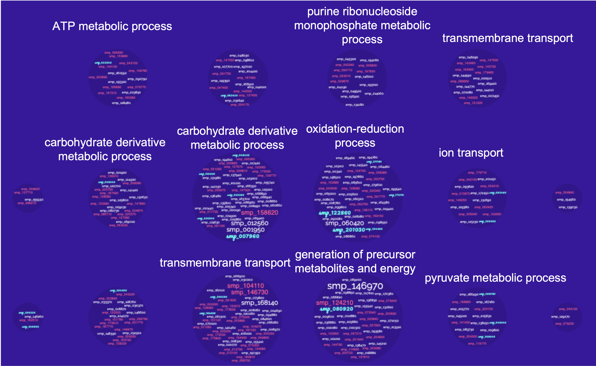

## The WormBase ParaSite Expression browser <a name="expression_data"></a>

Earlier in this section, we looked at a gene in JBrowse and used RNAseq tracks to see in which life stages it was expressed. What if you were interested in transcriptional differences between life stages, but didn't have a specific gene in mind?

You might want to retrieve **all** of the _S. mansoni_ genes that are differentially expressed between 2 life cycle stages. 

WormBase ParaSite has collated RNAseq data from publicly available studies and analysed it against our genomes and annotations.

This means that if somebody has already conducted a study to compare the conditions that you're interested in, you can look up pre-calculated differentially expressed genes. 

1. Navigate back to the _S. mansoni_ genome landing page, and select "Gene expression"


2. We can see a summary of the different studies that have been conducted. We're interested in life cycle stages, so select the first study "Schistosoma mansoni transcriptomics at different life stages". 



For each study, we have a summary of the conditions for which data is available. You'll learn much more about how transcriptomic experiments are analysed in module 7, but for those who are interested we have used HISAT2 to align reads to the genome, HTSeq to quantify counts per gene and DESeq2 to compute differential expression per condition.

Several files are available for download. These are:

* **Characteristics and conditions per run** - a file summarising the metadata available for each sample/run in the study.
* **Counts of aligned reads per run (FeatureCounts)** - for each gene, raw counts per sample/run as produced by HTSeq (not normalised for library size).
* **Gene expression (TPM) per run** - for each gene, counts per sample/run normalised for gene length and library size (TPM = transcripts per million).
* **Gene expression (TPM) per condition as median across replicates** - As above, but a median value is calculated for each gene from all samples/runs of the same condition.
* **Differential expression** - The number of files here varies. For each experiment, we extract the different conditions for which pair-wise comparisons are possible. For this experiment, only one variable is changing between the samples (developmental stage), so we have 3 possible contrasts: 24h schistosomule v 3h schistosomule, 24h schistosomule v cercariae and 3h schistosomule v cercariae. The second study in the list ("Praziquantel mode of action and resistance") is more complicated; we have several facets changing between conditions (drug treatment, development stage, timepoint, strain **and** sex), resulting in many more possible contrasts. We calculate differential expression for any pairwise combination of conditions that have three or more replicates: it's down to you to choose which of those comparisons is biologically meaningful. There are 2 types of file available here:
    - Summary files: for each combination of variables for which comparisons have been calculated, this file contains the genes that show a significant difference in at least one comparison. 
    - Full results files: each of these files contain the full DESeq2 results for a contrast (i.e., fold changes for ALL genes, whether or not they are statistically significant).


3. Download the full results files for the "Schistosoma mansoni transcriptomics at different life stages" "24-hour-schistosomule-vs-cercariae" experiment by clicking "Full result files for 3 contrasts (zipped) and place it into the "Module_3_WormBaseParaSite_2" directory.

```bash
cd ~/Module_3_WormBaseParaSite_2

# Extract the compressed directory
unzip ERP000427.de.contrasts.zip

# move inside the results directory
cd ERP000427.de.contrasts

# have a look at the 24-hour-schistosomule-vs-cercariae file
grep -v "^#" 24-hour-schistosomule-vs-cercariae.tsv | less
```

Use some of the commands you learned yesterday to extract the following information from the "24-hour-schistosomule-vs-cercariae.tsv" file:

4. Extract the top 5 most significantly regulated genes (hint: the final column, "padj", gives the adjusted p value. A smaller adjusted p value = more significant).

```bash
grep -v "^#" 24-hour-schistosomule-vs-cercariae.tsv | grep -v "^gene_id" | sort -g -k 7,7 | awk -F'\t' '$7 != "NA"' | head -n 5
```

5. Of the genes with an adjusted p-value that is less than 0.05, which is (a) most highly upregulated in the 24h schistosomules v the cercariae (b) most strongly upregulated in the cercariae v the 24h schistosomules?
```bash
# upregulated in the 24h schistosomules means tha Log2FoldChange (column 3) should be a positive number
grep -v "^#" 24-hour-schistosomule-vs-cercariae.tsv | grep -v "^gene_id" | awk -F'\t' '$7 != "NA" && $7 < 0.05 && $3 > 0' | sort -r -g -k 3,3 | head -n 10


# upregulated in the cercariate means tha Log2FoldChange (column 3) should be a negative number
grep -v "^#" 24-hour-schistosomule-vs-cercariae.tsv | grep -v "^gene_id" | awk -F'\t' '$7 != "NA" && $7 < 0.05 && $3 < 0' | sort -g -k 3,3 | head -n 10
```

[↥ **Back to top**](#top)

---
## Performing Gene-set enrichment analysis <a name="gene-set"></a> 

Gene set enrichment analysis (GSEA) (also called functional enrichment analysis or pathway enrichment analysis) is a method to identify classes of genes or proteins that are over-represented in a large set of genes or proteins, and may have an association with disease phenotypes.


In the previous module we talked about Gene Ontology (GO) [here](https://github.com/WCSCourses/HelminthBioinformatics_2023/blob/wbps_edits/manuals/module_1_WBP1/module_1_WBP1.md#go_terms).

"Gene Ontology" enrichment analysis is one of the most commonly used enrichment analyses.

Gene ontology is a formal representation of knowledge about a gene with respect to three aspects:
Molecular Function, Cellular Component and Biological Process.

So what is the Gene Ontology (GO) enrichment analysis?

Fundamentally, the gene ontology analysis is meant to answer a very simple question: “What biological processes, molecular functions, and cellular components are significantly associated with a set of genes or proteins?”

For example, we can take the list of genes we identified as significantly upregulated in cercariae vs 24h-schistosomules and try to identify what are the biological processes, cellular components and molecular functions that are implicated in this developmental stage comparison.

Instead of manually trying to identify which genes in your list of differentially expressed genes have similar biological processes, cellular component and molecular functions, the GO enrichment analysis does it for you. More specifically, it clusters the genes into gene ontologies group, performs statistical analysis and shows you the most significantly overepressented ontologies!

So basically a GO enrichment analysis takes a list of gene identifiers like this:


and organises them to Gene Ontology terms (GO):


<br><br>
WormBase ParaSite offers a tool that performs this kind of analysis: g:Profiler that can be accessed from the "Tools" page:

- Go to WormBase ParaSite (https://parasite.wormbase.org/). Click "Tools" at the top menu. Click "g:Profiler" in the tools table.


[↥ **Back to top**](#top)

---
