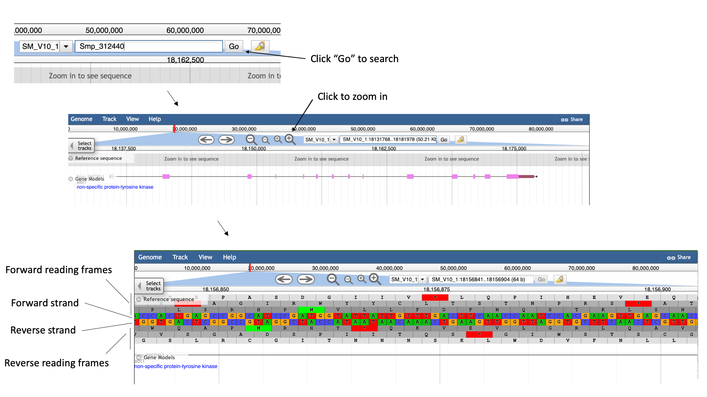
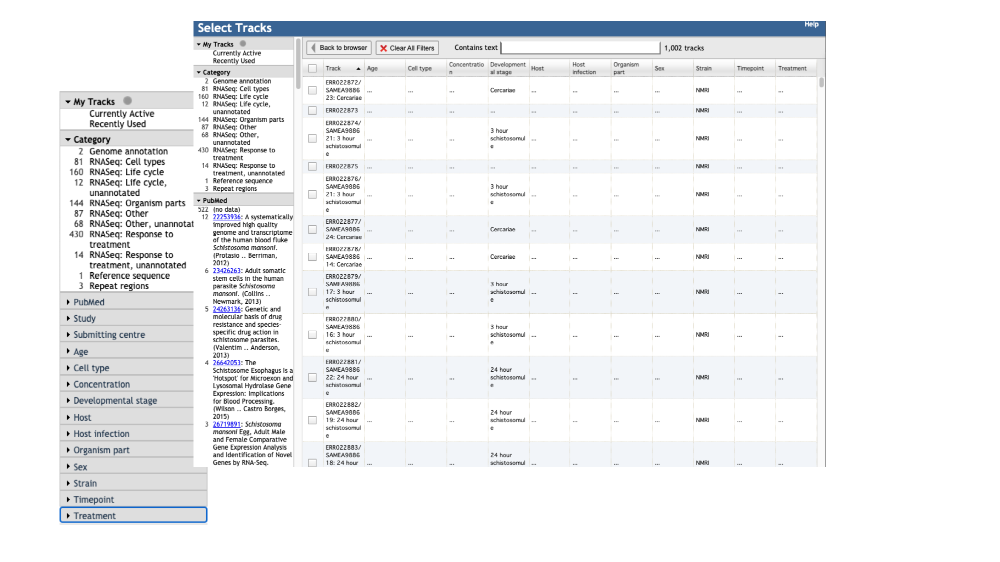
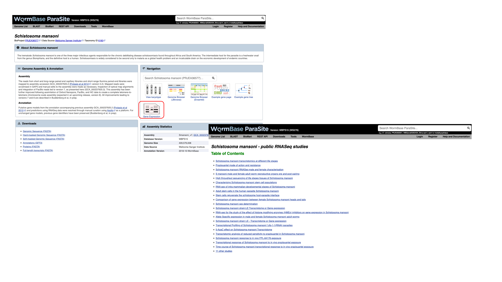

## Visualise RNA-Seq data using JBrowse Genome Browser

In this example we’ll introduce the basic functionality of WormBase ParaSite's JBrowse 1, and demonstrate how to use the various tracks.

1. Navigate to the _S. mansoni_ genome page and select the “Genome Browser (JBrowse)” icon.

- Each scaffold is represented from its 5-prime end to its 3-prime end (relative to the forward strand).
- You can navigate to different scaffolds using the drop down menu in the middle of the screen, or by typing coordinates into the text box.
- Different types of data aligned to the genome are represented as tracks. When you first open JBrowse, one track will be on by default: the reference gene set.

For this example, we’ll consider that you’re interested in the gene Smp_312440.

2. Start by typing the identifier into the search box and clicking “Go” to navigate to the gene. 
3. Zoom in by clicking the large magnifying glass with a “+” symbol until the reference sequence resolves.

Here, you can see the forward and reverse DNA strands, together with the six possible translational reading frames (3 forward and 3 reverse).

4. Zoom out again so that you have the whole gene model in your field of view.
5. To extract sequence information about the gene, click the gene model such that a dialogue box pops up.

Scrolling down the content of the box, you can extract genomic or cDNA sequence, or the sequence of specific subfeatures (specific exons or UTRs, for example).

Alternatively, you may wish to extract the genomic sequence of a whole region:

6. Click the arrow next to the “Reference sequence” track label in the top left of the screen, select “Save track data”, then download the sequence as a FASTA
file.

#### Tracks

We can also use JBrowse to view other types of data aligned to the genome. 

7. Click the “select tracks” button in the top left of the screen.

For most species, in addition to the gene model (“Genome Annotation”) track, there are two additional main types of track:

- Repeat regions tracks - repetitive regions of the genome are annotated as part of WormBase ParaSite’s production process. 
- RNASeq tracks - WormBase ParaSite has a process of finding and aligning RNASeq data in the sequencing archives for our species of interest. These can be useful, for example, for checking that a gene model is well supported by expression data, or seeing in which life stages, or under which conditions, a gene of interest is transcribed. 
  - For species with a lot of publicly available RNA-Seq data, such as _S. mansoni_, the easiest way to explore the samples that are available is by using the facets on the left hand side. The samples are organised by their metadata.

Let’s say you want to see in which life stages Smp_312440 is expressed:

8. Click the “developmental stage” facet 
9. Select a few of the available libraries (in the example below we've selected 3h schistosomules and miracidia) and click “back to browser”.

- Each track represents a different sequencing library, and shows the number of reads that have been aligned at each position. 
- By mousing over the histogram, you can see the exact number of aligned reads at each base. 
- We can see that a lot of the tracks show biological replicates of the same condition.- We can use combination tracks to combine replicate tracks “on the fly”, so we use up less space on the screen.

#### Visualising your own data

As well as looking at publicly available data, you can use WormBase ParaSite JBrowse to visualise your own data.

11. To add a local file to our Jbrowse instance:
    - select the “Track” menu option in the top left of the screen.
    - Selecting “Open track file or URL” will open a dialogue box giving you an option to view a file that is either on your file system, or accessible via a URL.
    - JBrowse guesses the file type from the name, but we have an option to correct it if it gets it wrong. We can see that it’s right this time.
    - Click “Open”.

If for example you upload an alignment file (BAM/SAM), after uploading it, you can see the reads aligned to the genome. Notice that this RNA-Seq data is stranded- this means that the library preparation protocol preserved information on which end of the RNA molecule was 5-prime and which end was 3-prime, so we can infer which strand of DNA it was transcribed from. This information is encoded in the BAM file, and JBrowse colours the reads accordingly:
- reads aligning to the forward strand are $\textcolor{pink}{\textsf{pink}}$
- and reads aligning to the reverse strand are $\textcolor{purple}{\textsf{purple}}$

[↥ **Back to top**](#top)

## The WormBase ParaSite Expression browser 

Earlier in this section, we looked at a gene in JBrowse and used RNAseq tracks to see in which life stages it was expressed. What if you were interested in transcriptional differences between life stages, but didn't have a specific gene in mind?

You might want to retrieve **all** of the _S. mansoni_ genes that are differentially expressed between 2 life cycle stages. 

WormBase ParaSite has collated RNAseq data from publicly available studies and analysed it against our genomes and annotations.

This means that if somebody has already conducted a study to compare the conditions that you're interested in, you can look up pre-calculated differentially expressed genes. 

1. Navigate back to the _S. mansoni_ genome landing page, and select "Gene expression"

2. We can see a summary of the different studies that have been conducted. We're interested in life cycle stages, so select the first study "Schistosoma mansoni transcriptomics at different life stages". 

For each study, we have a summary of the conditions for which data is available. You'll learn much more about how transcriptomic experiments are analysed in module 7, but for those who are interested we have used HISAT2 to align reads to the genome, HTSeq to quantify counts per gene and DESeq2 to compute differential expression per condition.

Several files are available for download. These are:

* **Characteristics and conditions per run** - a file summarising the metadata available for each sample/run in the study.
* **Counts of aligned reads per run (FeatureCounts)** - for each gene, raw counts per sample/run as produced by HTSeq (not normalised for library size).
* **Gene expression (TPM) per run** - for each gene, counts per sample/run normalised for gene length and library size (TPM = transcripts per million).
* **Gene expression (TPM) per condition as median across replicates** - As above, but a median value is calculated for each gene from all samples/runs of the same condition.
* **Differential expression** - The number of files here varies. For each experiment, we extract the different conditions for which pair-wise comparisons are possible. For this experiment, only one variable is changing between the samples (developmental stage), so we have 3 possible contrasts: 24h schistosomule v 3h schistosomule, 24h schistosomule v cercariae and 3h schistosomule v cercariae. The second study in the list ("Praziquantel mode of action and resistance") is more complicated; we have several facets changing between conditions (drug treatment, development stage, timepoint, strain **and** sex), resulting in many more possible contrasts. We calculate differential expression for any pairwise combination of conditions that have three or more replicates: it's down to you to choose which of those comparisons is biologically meaningful. There are 2 types of file available here:
    - Summary files: for each combination of variables for which comparisons have been calculated, this file contains the genes that show a significant difference in at least one comparison. 
    - Full results files: each of these files contain the full DESeq2 results for a contrast (i.e., fold changes for ALL genes, whether or not they are statistically significant).

3. Download the full results files for the "Schistosoma mansoni transcriptomics at different life stages" "24-hour-schistosomule-vs-cercariae" experiment by clicking "Full result files for 3 contrasts (zipped) and place it into the "Module_3_WormBaseParaSite_2" directory.

4. You can use the downloaded file to extract useful information. For example, you can fillter the file to retrieve the top 5 most significantly regulated genes (hint: the final column, "padj", gives the adjusted p value. A smaller adjusted p value = more significant).

[↥ **Back to top**](#top)

---
## Performing Gene-set enrichment analysis  

Gene set enrichment analysis (GSEA) (also called functional enrichment analysis or pathway enrichment analysis) is a method to identify classes of genes or proteins that are over-represented in a large set of genes or proteins, and may have an association with disease phenotypes.

In a previous workshop we talked about Gene Ontology (GO) [see more here](https://github.com/WCSCourses/HelminthBioinformatics_2023/blob/wbps_edits/manuals/module_1_WBP1/module_1_WBP1.md#go_terms).

"Gene Ontology" enrichment analysis is one of the most commonly used enrichment analyses.

Gene ontology is a formal representation of knowledge about a gene with respect to three aspects:
Molecular Function, Cellular Component and Biological Process.

So what is the Gene Ontology (GO) enrichment analysis?

Fundamentally, the gene ontology analysis is meant to answer a very simple question: “What biological processes, molecular functions, and cellular components are significantly associated with a set of genes or proteins?”

For example, we can take the list of genes we identified as significantly upregulated in cercariae vs 24h-schistosomules and try to identify what are the biological processes, cellular components and molecular functions that are implicated in this developmental stage comparison.

Instead of manually trying to identify which genes in your list of differentially expressed genes have similar biological processes, cellular component and molecular functions, the GO enrichment analysis does it for you. More specifically, it clusters the genes into gene ontologies group, performs statistical analysis and shows you the most significantly overepressented ontologies!

So basically a GO enrichment analysis takes a list of gene identifiers like this:

and organises them to Gene Ontology terms (GO):

  
WormBase ParaSite offers a tool that performs this kind of analysis: g:Profiler that can be accessed from the "Tools" page:

1. Go to WormBase ParaSite (https://parasite.wormbase.org/). Click "Tools" at the top menu. Click "g:Profiler" in the tools table.

2. Let's say you've performed a differentially expressed analysis and came up with a list of differentially expressed genes between two conditions for _S. mansoni_.

List of downregulated genes:

Smp_131770 
Smp_042150 
Smp_180620 
Smp_086530 
Smp_075800 
Smp_179170 
Smp_142800 
Smp_139240 
Smp_070240 
Smp_202610 
Smp_095520 
Smp_067060 
Smp_074450 
Smp_054300 
Smp_149170 
Smp_123880 
Smp_123540 
Smp_105410 
Smp_139160 
Smp_197370 
Smp_201060 
Smp_043270 
Smp_043250 
Smp_137700 
Smp_194910 
Smp_103610 
Smp_123830 
Smp_194980 
Smp_085180 
Smp_035290 
Smp_128940 
Smp_195180 
Smp_200800 
Smp_141500 
Smp_196840 
Smp_195190 
Smp_123270 
Smp_169200 
Smp_158750 
Smp_119050 
Smp_152580 
Smp_170630 
Smp_130250 
Smp_211020 
Smp_010550 
Smp_016490 
Smp_137720 
Smp_155570 
Smp_143270 
Smp_024180 

4. Paste the list of downregulated gene IDs into the central text box. Select "Schistosoma Mansoni" under WormBase ParaSite using the "Organism" drop-down menu and then click on "Run Query".

5. When results appear, scroll down and hover over the points in the graph to explore gene ontologies which are over-represented in your list of genes. You can also click on "Detailed Results" tab to see a table with all the enriched Gene ontology terms.

You can read more about the details of the results in the [gProfiler webpage](https://biit.cs.ut.ee/gprofiler/page/docs).

[↥ **Back to top**](#top)

---
