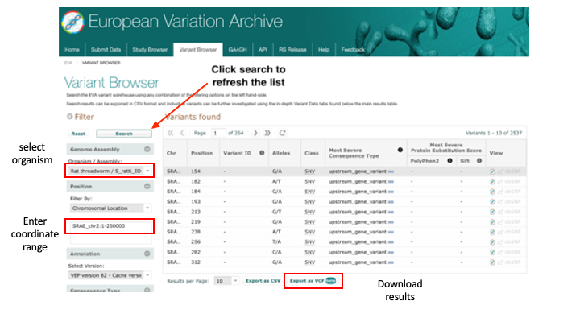
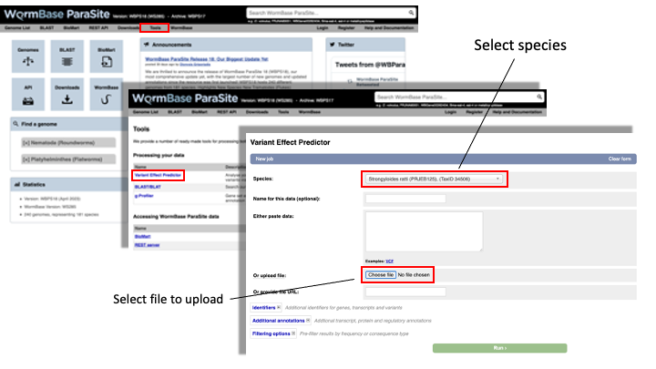

### From Variants to 3D Protein Models 

A common approach to understanding the genetic basis of phenotypic differences is to identify genetic variants that are overrepresented in some populations of individuals.

For example, you might sequence two populations of worm: one that is susceptible to a drug and one that is resistant to the drug. You could then identify genomic positions where each of these populations differs from the reference genome.

WormBase ParaSite's Variant Effect Predictor (VEP) is a tool that allows you to predict what the consequences of these variants are: whether they fall within or near genes, and whether they result in a change to the amino acid sequence of a protein.

The standard file format for storing variation data is the [Variant Call Format (VCF)](https://samtools.github.io/hts-specs/VCFv4.2.pdf); this is another tab-delimited text format. Today you’ll be using an available VCF file for _Strongyloides ratti_. 

First, we'll download a VCF file from the European Variation Archive (EVA).   Then will upload it to WormBase ParaSite

1. Go to the [European Variation Archive (EVA)](https://www.ebi.ac.uk/eva/).
2. Select the "Variant Browser" tab.

You can download complete studies from the "Study Browser" tab but today we are using the "Variant Browser" to download a much smaller file corresponding to a 250 kb region of the genome.

3. Download the first 250kb of S. ratti chromosome 2:
  - Select "Rat threadworm / S_ratti_ED321" from the Organism/Assembly drop-down menu.
  - Filter by: Chromosomal Location - Region: SRAE_chr2:1-250000 and then click "Search".
  - Click "Export as VCF" and place the downloaded file inside the "Module_3_WormBaseParaSite_2" directory.

4. From the WormBase ParaSite homepage, select “Tools” from the toolbar.
5. From the “Tools” page, select Variant Effect Predictor
6. To submit a VEP job, just select the correct species (_Strongyloides ratti_), upload the VCF file we just downloaded and click “Run”.

7. Once you have clicked "Run", your input will be checked and submitted to the VEP as a job. All jobs associated with your session or account are shown in the "Recent Tickets" table. You may submit multiple jobs simultaneously.

8. Navigate to the results page:

The results are presented in pie-charts and an interactive table:
- Pie Charts: The pie charts give a summary of the consequences of the variants found in the file. Variants with coding consequences are found in the protein-coding sequence of genes, whilst variants with non-coding consequences are in intergenic regions or non-coding regions of genes. These variants could still be functionally important; for example, variants in non-coding regions near genes can have effects on expression dynamics.
- Results Table: The results table shows one row per transcript and variant. By default all of the columns are shown; to temporarily hide columns, click the blue "Show/hide columns" button and select or deselect the columns you wish to view. The columns you select will be recalled when viewing other jobs.

9. You can explore the results interactively on the webpage using the Results Preview filter panel at the centre. Use this panel and filter for variant that cause (select "consequence") changes to amino acids (select "missense_variant").  

You can actually visualise the affected Amino acid by the "missense_variant" on the protein's 3D AlphaFold model ([We talked about these in our previous WBP module](https://github.com/WCSCourses/HelminthBioinformatics_2023/blob/main/manuals/module_1_WBP1/module_1_WBP1.md#af)).

To do this:

10. Go to the "Protein matches" column of the results table. If the "Protein matches" column has not been switched on you can do so by using the "Show/hide columns" button at the top left of the table". If the protein affected by the "missense_variant" has an AlphaFold protein model available, then you should see an "AlphaFold model" button in the "Protein matches" column. Click it.

11. Explore the 3D protein model. You can  Click the "Focus" button underneath the variant information to zoom-in to the affected residue.

[↥ **Back to top**](#top)
